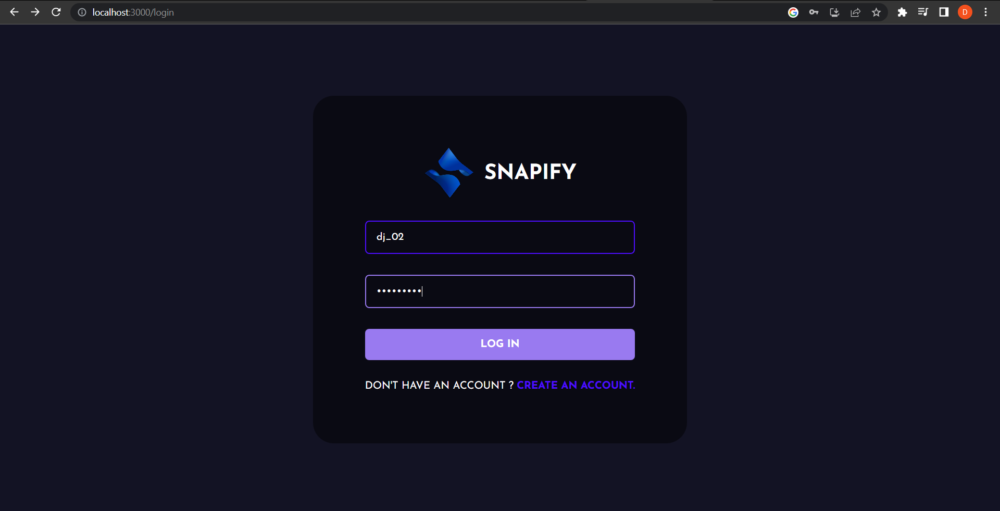
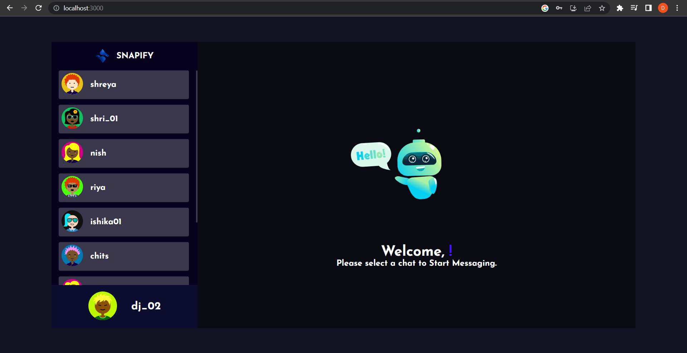
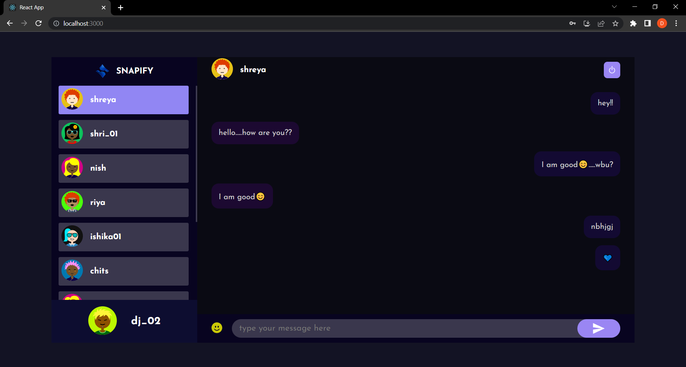

# SNAPIFY

It is a real-time chat application which is made using React, Node.js and Socket.io with MongoDB to provide users' a hassle free chatting experience while maintaining the users' privacy through end-to-end encryption. It has features like creating your own avatar, sending text messages with emojis etc.

## Screenshots

1. Register:

2. Login:

3. SetAvatar:

4. Welcome:

5. Chat:

